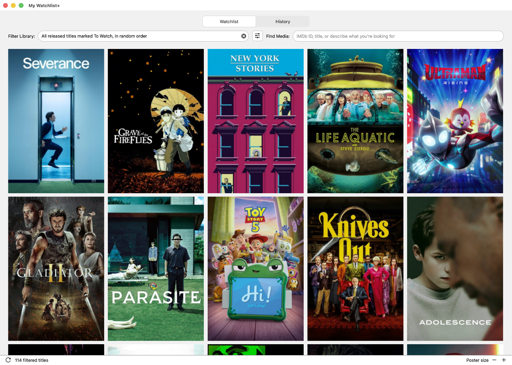
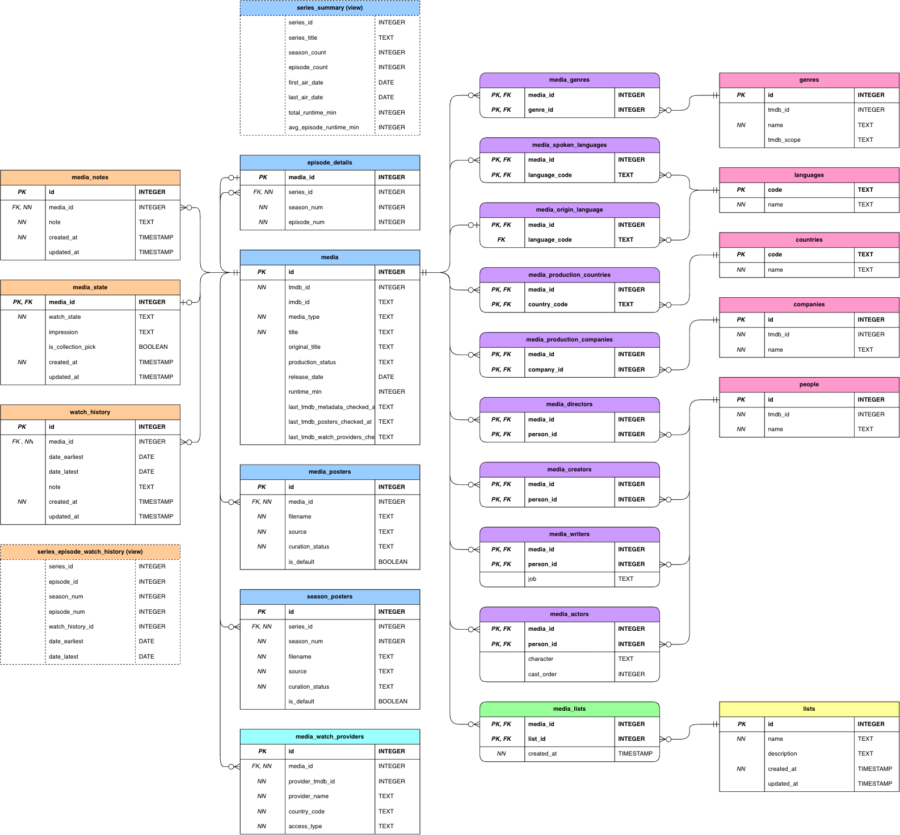

# My Watchlist+

## About the project

This project is my (admittedly slightly overengineered) answer to a very simple problem: I wanted a watchlist for movies and TV series that I could truly make my own.

By that, I mean a local and independent experience where my data remains mine, advertising stays out of the way, and the application can be shaped around my own taste rather than the priorities and constraints of a third-party platform.

The result is a clean and enjoyable personal movie and TV series library, simple on the surface but detailed and flexible underneath, with plenty of room to explore and dig deeper.



## What it does

- Find and add movies, TV series and individual episodes to your library
- Use LLM-assisted search for title resolution and natural-language library queries
- Retrieve and keep detailed metadata for every title
- Mark titles as *To Watch*, *Watched*, *Not Interested* or *Dropped* (for series)
- Keep a complete and flexible watch history, including multiple viewings of the same title
- Rate titles, keep notes, curate a personal collection and create custom lists
- Choose and manage alternative posters for each title
- Check streaming availability for a selected region
- Filter, sort and pin titles to browse the collection

## Under the hood

At its core, this is a Python desktop application built with PySide6 and backed by a local SQLite database.

The desktop/local-first approach is deliberate. The application is currently designed as a single-user tool, so keeping the interface, application logic and database on the same machine avoids introducing a client/server architecture that the current requirements do not need. It also keeps the project entirely within the Python ecosystem, which fits naturally with the data, recommendation and machine-learning experiments I want to explore later.

Movie and TV metadata comes primarily from the TMDB API, while LLMs are used selectively where natural language is actually useful: resolving less straightforward title searches and translating natural-language requests into structured library queries.

## Database design

I spent quite a bit of time thinking through the database model, and TV series quickly became one of its more interesting challenges. Movies are relatively straightforward units, while series can be tracked at very different levels of detail. A _Black Mirror_ episode may be worth treating almost like a movie of its own, with an independent watch state, a rating or even a poster. With _Friends_, the series itself may matter more, while episode progress still matters. With _ALF_, on the other hand, "I watched some _ALF_" may honestly be precise enough.

My solution to this central challenge was to let movies, series and episodes share the same core `media` model. Episodes remain linked to their parent series, but both the series and its individual episodes can be tracked independently, each with their own state, watch history, rating, notes, lists and poster. At the same time, episode-level information can still be brought together to track progress through the series. Detailed episode tracking is possible, but never required.

<picture>
  <source media="(prefers-color-scheme: dark)" srcset="docs/images/database-schema-dark.png">
  <source media="(prefers-color-scheme: light)" srcset="docs/images/database-schema-light.png">
  
</picture>

A few other decisions that shaped the model:

- **State and history are separate concerns.** A title can have a current watch state while preserving any number of individual viewing sessions.
- **Precision is optional.** Watch dates can be exact, expressed as a range or left unknown instead of forcing information the user may not have.
- **TMDB is a source, not the schema.** Relevant metadata is selectively imported and normalized into reusable local entities rather than mirroring the API response.
- **Derived information does not need to be duplicated.** Views provide series-level summaries and episode history where the application needs them.

## AI-assisted development

Coding agents, mainly OpenAI Codex, have become a major part of how I build this project, and exploring that way of working is part of the project as well. Much of the implementation is agent-assisted, while the overall structure, product direction, workflows, data model, UI and UX are deliberately designed and directed by me, with generated changes carefully reviewed and tested throughout development.

## What's next

The current version is already functional, but there are several directions I want to take it next:

- Build richer and playful statistics and visualizations around the library and watch history
- Add new metadata sources for awards, festivals and other information not readily available through TMDB
- Experiment with personalized recommendation systems using machine learning, web scraping and public datasets
- Develop a chatbot that adds a more personal layer to recommendations and offers an alternative way to interact with the library
- Keep refining the existing application with smaller features, UI improvements and ongoing work on the codebase

## Running locally

### Requirements

- Python 3.11 or newer
- A [TMDB Read Access Token](https://developer.themoviedb.org/docs/authentication-application)
- Optionally, an OpenAI API key for AI-assisted title resolution

### Setup

```bash
git clone https://github.com/paulotosold/my-watchlist-plus.git
cd my-watchlist-plus

python3 -m venv .venv
source .venv/bin/activate

python -m pip install -r requirements.txt
cp .env.example .env
```

Add your TMDB token to `.env`. To enable the optional AI-assisted lookup, add an OpenAI API key as well.

You can also adjust the watch region in `settings.toml`.

```bash
python main.py
```

The SQLite database is created automatically at `data/media.db`, while downloaded posters are stored in `data/media_posters/`. Both remain local and are excluded from version control.

The application has been developed and tested on macOS 26 with Python 3.13. Other platforms may work, but have not yet been formally tested.

## Project structure

The codebase is organized around a small set of responsibilities:

```text
app/                       # application source code
├── assets/                # bundled UI icons and images
├── find_media/            # media search and title resolution
├── history/               # watch history interface and queries
├── media_details/         # media details and editing workflows
├── media_draft/           # media draft building and saving
├── media_repository/      # persistence and data access
├── media_user_data/       # domain logic for lists, notes and watch data
├── metadata_refresh/      # background metadata refresh workflows
├── tmdb/                  # TMDB integration
├── ui/                    # shared UI components
└── watchlist/             # main watchlist interface

db/                        # database connection, schema, migrations and seed data
data/                      # local SQLite database and downloaded posters
docs/                      # project documentation
scripts/                   # import and maintenance utilities
tests/                     # automated test suite

main.py                    # application entry point
settings.toml              # application settings
.env.example               # environment variable template
requirements.txt           # Python dependencies
```

## Data sources and attribution

Movie and TV metadata and images are provided by TMDB, with streaming availability data from JustWatch via TMDB. This product uses the TMDB API but is not endorsed or certified by TMDB.

## License

This project is licensed under the MIT License. See [LICENSE](LICENSE) for details.
